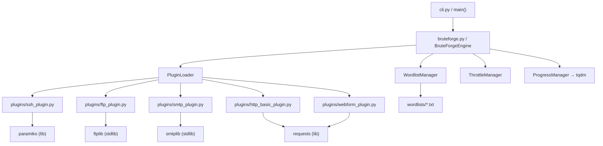

# BruteForge

Modular brute-force framework for SSH, FTP, SMTP, HTTP Basic Auth, and web login forms. Plugin-based architecture — each protocol is an independent module loaded at runtime.

> Filed notes from a 3-week internal tooling project. Cleaned up for release but the bones are honest.

## Architecture



Each plugin implements a `BasePlugin` interface with `authenticate()`, `detect()`, and metadata fields. The engine doesn't care about protocol details — it just calls `.authenticate(host, port, username, password)` and checks the return.

## Plugins

| Plugin | Target | Library | Notes |
|--------|--------|---------|-------|
| SSH | sshd on port 22 | paramiko | Handles key exchange errors gracefully |
| FTP | FTP servers | ftplib (stdlib) | Anonymous detection built in |
| SMTP | SMTP AUTH | smtplib (stdlib) | AUTH LOGIN/PLAIN |
| HTTP Basic | Basic Auth endpoints | requests | 401 detection |
| Web Form | POST login forms | requests | Needs form field config |

## Usage

```
python bruteforge.py ssh --target 192.168.1.100 --user admin -w wordlists/rockyou.txt --threads 8
python bruteforge.py ftp --target 10.0.0.5 --user-list users.txt -w pass.txt --delay 0.5
python bruteforge.py http-basic --target https://example.com/admin -u admin -w wordlist.txt
```

### Options

- `--target` / `-t`: Target hostname or IP
- `--port` / `-p`: Port (auto-detected if omitted)
- `--user` / `-u`: Single username
- `--user-list` / `-U`: File of usernames
- `--wordlist` / `-w`: Password file
- `--threads`: Worker count (default: 4)
- `--delay`: Seconds between attempts (default: 0)
- `--timeout`: Connection timeout (default: 10)

## Wordlists

Place wordlists in `wordlists/` directory. Format: one entry per line, LF terminated. Blank lines and lines starting with `#` are skipped.

## TODO

- [ ] RDP plugin (FreeRDP bindings are a nightmare on Windows)
- [ ] Rate-limit detection + backoff per-target
- [ ] Proxy support is half-baked in HTTP modules
- [ ] Plugin hot-reload without restart (low priority)

## Known Issues

- SMTP plugin falls over on servers that advertise AUTH but don't actually support it. Workaround: skip detection, force mode.
- SSH key auth not implemented — password-only right now. FIXME in ssh_plugin.py line 47.
- Wordlist manager loads everything into memory. Don't feed it a 50GB wordlist on a laptop.

## License

MIT — see LICENSE file. Don't be an idiot with this.
